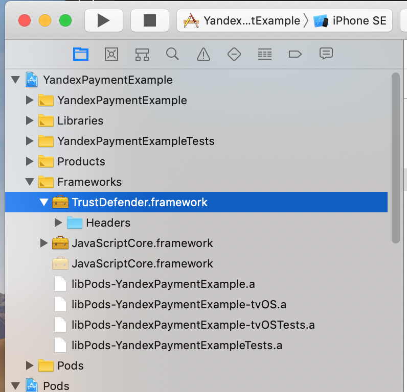

What is it
----------

Library for implement Yandex Checkout functionality on React Native environment.

Android library: [2.3.0](https://github.com/yandex-money/yandex-checkout-android-sdk)

iOS library: [2.2.0](https://github.com/yandex-money/yandex-checkout-payments-swift)


Usage
=====

```ts
import YandexPayment, { Shop, Payment, PaymentToken } from 'react-native-yandex-payment';

const shop: Shop = {
    id: 'SHOP_ID',
    token: 'test_SHOP_TOKEN',
    name: 'Shop name',
    description: 'Shop description',
}
const payment: Payment = {
    amount: 399.99,
    currency: 'RUB', // 'RUB' | 'USD' | 'EUR'
    types: ['BANK_CARD'], // 'YANDEX_MONEY' | 'BANK_CARD' | 'SBERBANK' | 'PAY'. PAY - means Google Pay or Apple Pay
}
const paymentToken: PaymentToken = await YandexPayment.show(shop, payment)
console.warn(paymentToken.token) // payment token
console.warn(paymentToken.type) // payment method type
```

Install
=======

```bash
npm install react-native-yandex-payment --save 
```
or
```bash
yarn add react-native-yandex-payment
```

Android
-------

Add Yandex repository inside `android/build.gradle`
```groovy
allprojects {
    repositories {
      ...
      maven { url 'https://dl.bintray.com/yandex-money/maven' }    
    }
}
```

Enable multidex if needed in `android/app/build.gradle`
```diff
android {
    defaultConfig {
        ...
+        multiDexEnabled true
    }
}

dependencies {
    ...
+    implementation 'androidx.multidex:multidex:2.0.1'
}
```

Add Yandex Client ID in `android/app/build.gradle`
```groovy
android {
    defaultConfig {
        manifestPlaceholders = [YANDEX_CLIENT_ID: "ваш id приложения в Яндекс.Паспорте"]
    }
}
```

iOS
---

Update your `ios/Podfile`
```ruby
target 'MyApp' do

    # ... other dependencies

    pod 'MyFramework', :path => '../node_modules/react-native-yandex-payment/ios/MyFramework.podspec'

    pod 'YandexCheckoutPayments',
        :git => 'https://github.com/yandex-money/yandex-checkout-payments-swift.git',
        :tag => '2.2.0',
        :modular_headers => true

    pod 'YandexLoginSDK',
        :git => 'https://github.com/yandexmobile/yandex-login-sdk-ios',
        :tag => '2.0.2',
        :modular_headers => true
end

pre_install do |installer|
	installer.analysis_result.specifications.each do |s|
        if s.name == 'When'
            s.swift_version = '4.2'
        end
    end
end
```

Install pods in `ios`
```bash
pod install
```

Open newly generated `.xcworkspace` in XCode and create new swift file. 
Be sure, that it have Foundation import
```swift
import Foundation
```

Create `Frameworks` directory inside `ios` folder
```bash
cd ios && mkdir Frameworks
```

Put inside `ios/Frameworks` `TrustDefender.framework` (you should receive your own TrustDefender.framework from Yandex support).

Be sure, that TrustDefender has Header folder inside it


Roadmap
=======

- [x] React Native 60.5
- [x] Types embedded
- [x] Android support
- [x] iOS support
- [x] Bank card, Yandex Wallet, Sberbank, Google Pay and Apple Pay payment types support (you should properly configure your shop for this)
- [ ] Change color scheme
- [ ] Configure test environment

If you have a question or need specific feature, feel free to [open an issue](https://github.com/lamantin-group/react-native-yandex-payment/issues/new) or create pull request.


---
```
The MIT License

Copyright (c) 2010-2019 Lamantin Group, LTD. https://lamantin.group

Permission is hereby granted, free of charge, to any person obtaining a copy
of this software and associated documentation files (the "Software"), to deal
in the Software without restriction, including without limitation the rights
to use, copy, modify, merge, publish, distribute, sublicense, and/or sell
copies of the Software, and to permit persons to whom the Software is
furnished to do so, subject to the following conditions:

The above copyright notice and this permission notice shall be included in
all copies or substantial portions of the Software.

THE SOFTWARE IS PROVIDED "AS IS", WITHOUT WARRANTY OF ANY KIND, EXPRESS OR
IMPLIED, INCLUDING BUT NOT LIMITED TO THE WARRANTIES OF MERCHANTABILITY,
FITNESS FOR A PARTICULAR PURPOSE AND NONINFRINGEMENT. IN NO EVENT SHALL THE
AUTHORS OR COPYRIGHT HOLDERS BE LIABLE FOR ANY CLAIM, DAMAGES OR OTHER
LIABILITY, WHETHER IN AN ACTION OF CONTRACT, TORT OR OTHERWISE, ARISING FROM,
OUT OF OR IN CONNECTION WITH THE SOFTWARE OR THE USE OR OTHER DEALINGS IN
THE SOFTWARE.
```